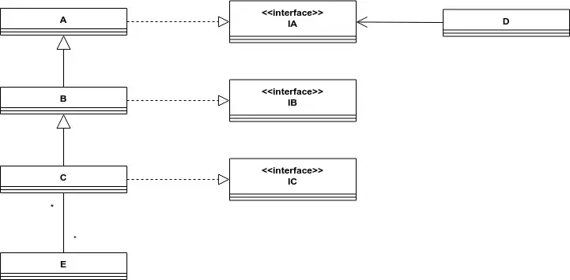

# Java MOOC Exercise – Class Diagram

Below you'll see a somewhat larger class diagram.  
In it are the classes **A**, **B**, **C**, **D**, and **E**,  
as well as the interfaces **IA**, **IB**, and **IC**.

Your task is to create these classes and interfaces in Java,  
following the relationships shown below.

Side note: https://yuml.me/ or https://draw.io/ can be used to create our own class diagrams.
